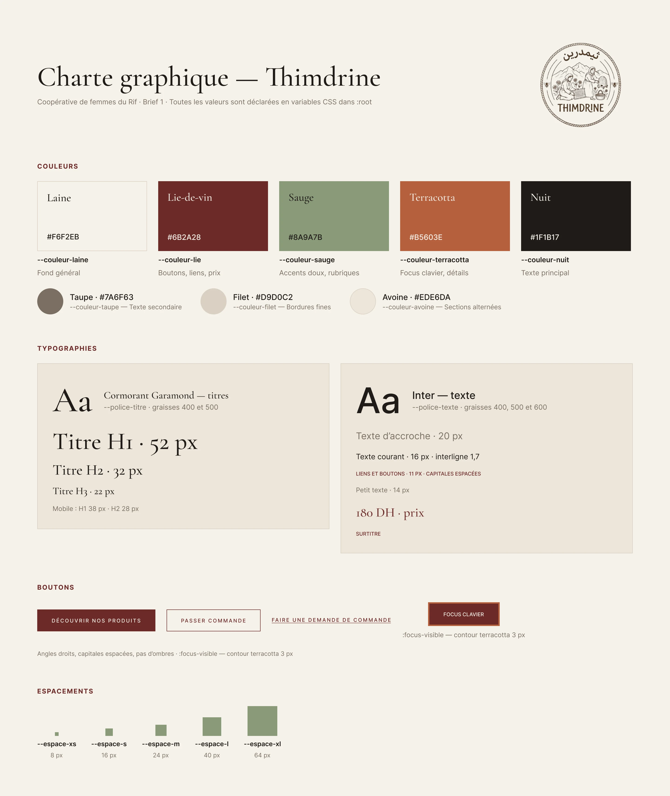

# Site vitrine Thimdrine

Un site vitrine adaptatif qui présente la coopérative Thimdrine, ses produits et les moyens de la contacter.

> **Aperçu en ligne :** pas encore disponible.

## Pages

- **Accueil** — présentation, partenaires et produits mis en avant
- **À propos** — la coopérative et son savoir-faire
- **Produits** — le catalogue des produits
- **Contact** — un formulaire avec validation des champs dans le navigateur

Le formulaire vérifie les informations saisies dans le navigateur. Il devra être relié à un service de réception ou à un serveur pour pouvoir envoyer les messages.

## Organisation du projet avec Scrum

J’ai utilisé un tableau GitHub Projects pour organiser les tâches, suivre leur avancement et rendre le processus de développement plus clair. Le tableau montre comment le projet a été planifié et découpé en étapes réalisables.

[Consulter le tableau de projet Thimdrine](https://github.com/users/ahtalbi/projects/4)

## Design

J’ai commencé par créer une maquette dans Figma, puis j’ai défini une direction visuelle chaleureuse et soignée, inspirée d’autres sites.

### Maquette Figma

[Ouvrir le design Thimdrine dans Figma](https://www.figma.com/design/ceqEvMBfV7Ouoq3zpwS8A0/Untitled--Copy---Copy-?node-id=6-6&t=8seS7PdvLUJGfoEw-1)

### Univers visuel

### Couleurs

La palette a été choisie après l’étude d’autres sites et de références visuelles. Elle associe des tons neutres et chaleureux à des accents lie-de-vin, sauge et terracotta.

### Polices

La typographie s’inspire des références visuelles. Les polices ont été téléchargées depuis [Google Fonts](https://fonts.google.com/).

## Technologies utilisées

- HTML
- CSS

## Mise en page et structure HTML

### Flexbox

Flexbox est un outil CSS qui permet de disposer des éléments sur une ligne ou dans une colonne. Il facilite leur alignement et la gestion de l’espace, et aide la mise en page à s’adapter aux différentes tailles d’écran. Le site l’utilise notamment pour aligner des éléments et placer des blocs côte à côte. Les règles adaptées aux petits écrans peuvent ensuite les empiler.

Parmi les propriétés Flexbox courantes : `display: flex`, `flex-direction`, `justify-content`, `align-items` et `gap`.

### Les balises HTML sémantiques

Les balises sémantiques décrivent le rôle du contenu qu’elles encadrent. Par exemple, `<header>` désigne l’en-tête, `<nav>` regroupe les liens de navigation, `<main>` contient le contenu principal, `<section>` rassemble des éléments liés, `<article>` représente un contenu autonome et `<footer>` contient les informations de pied de page.

Choisir des balises adaptées rend la structure plus facile à comprendre et à maintenir. Cela aide aussi les navigateurs, les moteurs de recherche et les technologies d’assistance à interpréter la page. On peut utiliser une balise `
` lorsqu’aucune balise sémantique ne correspond au rôle du bloc.

## Expérience utilisateur

L’objectif est de proposer un site soigné et simple à parcourir, avec une navigation claire, une mise en page adaptative et des images de produits qui racontent l’histoire de la coopérative.
