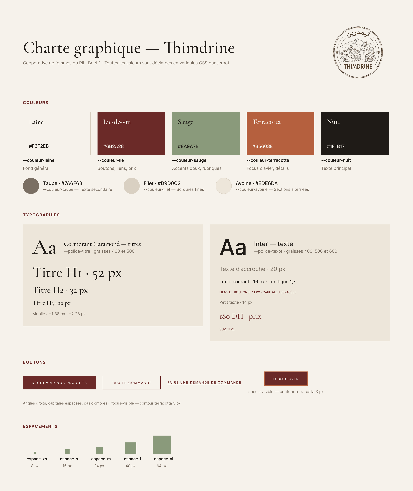

# Thimdrine Website

A responsive showcase website for Thimdrine, presenting the cooperative, its products, and ways to get in touch.

> **Live preview:** Not available yet.

## Pages

- **Home** — introduction, partners, and featured products
- **About** — the cooperative and its work
- **Products** — the product catalog
- **Contact** — a contact form with client-side field validation

The contact form currently validates entries in the browser. It needs a receiving service or backend before it can deliver messages.

## Project planning with Scrum

I used a GitHub Projects board to organize the work into tasks, track progress, and make the development process easier to follow. The board shows how the project was planned and how the work was split into manageable pieces.

[View the Thimdrine project board](https://github.com/users/ahtalbi/projects/4)

## Design

I started by creating a design in Figma, then shaped the visual direction around a warm, premium feel inspired by other websites.

### Figma

[Open the Thimdrine design in Figma](https://www.figma.com/design/ceqEvMBfV7Ouoq3zpwS8A0/Untitled--Copy---Copy-?node-id=6-6&t=8seS7PdvLUJGfoEw-1)

### Visual theme

### Colors

The palette was chosen after looking at other websites and design references. It uses warm neutrals with wine, sage, and terracotta accents.

### Fonts

The typography takes inspiration from the design references. The fonts were downloaded from [Google Fonts](https://fonts.google.com/).

## Built with

- HTML
- CSS
- JavaScript for contact form validation

## Layout and HTML structure

### Flexbox

Flexbox is a CSS layout tool for arranging items in a row or a column. It helps align and space elements, and makes it easier for a layout to adapt to different screen sizes. For example, this site uses flex layouts for navigation and to place content beside each other; media queries can stack that content on smaller screens.

Common Flexbox properties include `display: flex`, `flex-direction`, `justify-content`, `align-items`, and `gap`.

### Semantic HTML

Semantic HTML tags describe the purpose of the content they contain. For example, `<header>` represents introductory content, `<nav>` contains navigation links, `<main>` holds the page’s main content, `<section>` groups related content, `<article>` represents a standalone item, and `<footer>` contains closing or site information.

Using the right semantic tags makes pages easier to understand and maintain. It also helps browsers, search engines, and assistive technologies interpret the page structure. Use a regular `
` when no specific semantic meaning applies.

## UI and UX

The goal is to make the site feel polished and easy to explore, with clear navigation, responsive layouts, and product imagery that supports the cooperative’s story.
